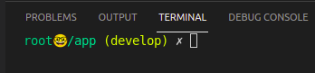
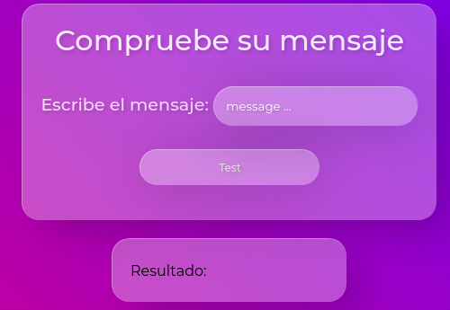

# Challenge

Un mensaje tiene los paréntesis balanceados cuando cumple una de las siguientes reglas:
1. Es un mensaje vacío
2. Contiene sólo una o más repeticiones de las letras "a" a la "z", espacio " ", o dos puntos ":"
3. Comienza por un paréntesis de apertura "(", seguido de un mensaje con paréntesis balanceados, seguido de un paréntesis de cierre ")"
4. Es un mensaje con paréntesis balanceados seguido de otro mensaje con paréntesis balanceados
5. Es un emoticón feliz ":)" o uno triste ":("

Crea un programa que identifique *si existe al menos una forma* de interpretar la entrada como un mensaje de paréntesis balanceados. La entrada es un string y la salida debe ser "balanceado" o "desbalanceado"

Ejemplos:

    a. "hola" -> balanceado
    b. "(hola)" -> balanceado
    c. "(()" -> desbalanceado
    d. "(:)" -> balanceado (ej, si consideramos el mensaje como un ":" [regla 2] entre paréntesis [regla 3])
    e. "no voy (:()" -> balanceado (ej, si consideramos un emoticón triste [regla 5] entre paréntesis [regla 3])
    f. "hoy pm: fiesta :):)" -> balanceado
    g. ":((" -> desbalanceado
    h. "a (b (c (d) c) b) a :)" -> balanceado (ej, si el último paréntesis es en realidad un emoticón)

## To prove the app

You can visit https://challenge-app-david29.herokuapp.com/

## About the app

This Challenge was made in Ruby on Rails

1. The database is PostgreSQL.
2. Models are: Messages
<br></br>

    * Message:
        * id: integer
        * body: string
        * status: string

## To Start

In this the project use Docker Container and Docker Compose to run the project.

1. Clone the repository in your computer.

2. Open the folder Capstone-Api in a code editor.

3. Create an .env file and fill it with your GitHub credentials.

```env
GIT_USER_NAME=Example-mail
GIT_USER_EMAIL=example@mail.com
```
4. In the terminal run (you have to located in the Capstone-Api folder):
```bash
$ sudo docker-compose up
```

5. Open another terminal and run:
```bash
$ sudo docker-compose exec client bash
```
when you see something like this:



you are in good way.

6. Now you hahve to install the gems:
```bash
$ bundle install
```
then
```bash
$ bundle update
```

7. Now it is time to run the migrations
```bash
$ rails db:migrate
```

8. Finally, you can run the server:
```bash
$ rails s -b 0.0.0.0
```

## Finally

You can open your localhost in your browser and you can see the project.

http://localhost:3000





## To Stop

1. In the terminal use Ctrl + C to stop the server.


<br/><br/>
### Ready, you can enjoy!

<br/><br/>

*Made by Monito Inc. 🙊*
